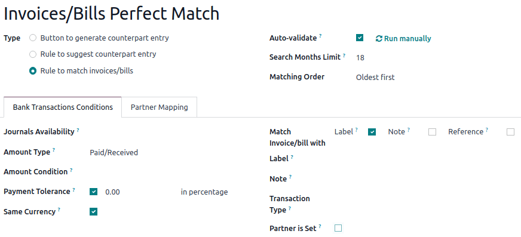
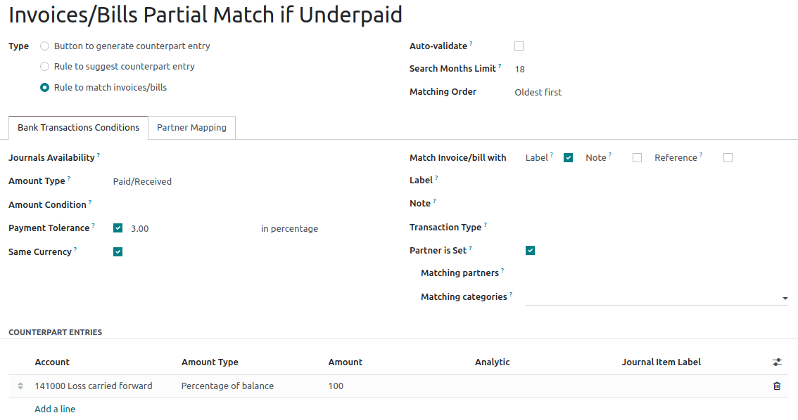
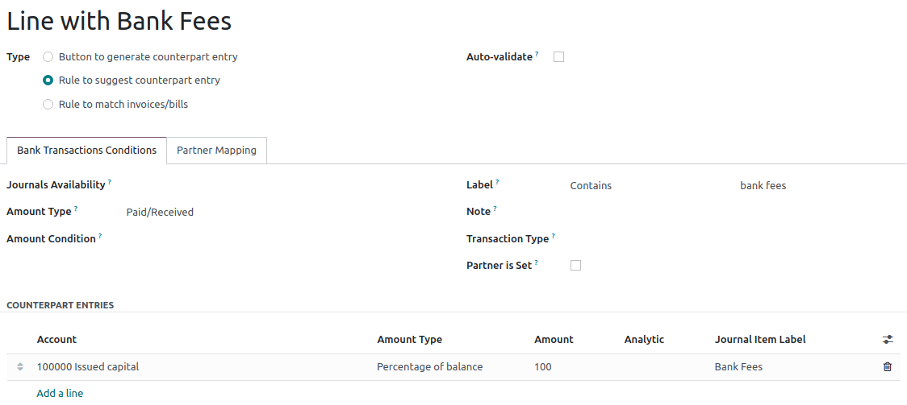

=====================
Reconciliation models
=====================

Reconciliation models are used to automate the :doc:`reconciliation` process, which is especially
handy when dealing with recurrent entries like bank fees. The reconciliation models can also be
helpful to handle :doc:`cash discounts <../customer_invoices/cash_discounts>`.

Each model is created based on a :ref:`model type <models/type>`, and
:guilabel:`bank transactions conditions`.

.. seealso::
   - :doc:`bank_synchronization`
   - :doc:`../customer_invoices/cash_discounts`
   - `Odoo Tutorials: <https://www.odoo.com/slides/slide/reconciliation-models-1841?fullscreen=1>`_

.. _models/type:

Reconciliation models types
===========================

For each reconciliation model, a :guilabel:`Type` should be set. Three types of models exist:

- :guilabel:`Rule to match invoices/bills`: used by-default;
- :guilabel:`Rule to suggest counterpart entry`: used for recurrent transactions, based on the bank
  transactions conditions;
- :guilabel:`Button to generate counterpart entry`: a button is created in the resulting entry
  section of the bank reconciliation view, to reconcile transactions based on rules set in the
  model, including the counterpart account.

By-default reconciliation models
================================

Different models are available by-default, and can be updated if needed, by going to
:menuselection:`Accounting --> Configuration --> Banks: Reconciliation Models`. Users can also create
their own reconciliation models, by clicking :guilabel:`New`.

.. important::
   If a record matches with several reconciliation models, the first one in the *sequence* of models
   is applied. You can rearrange the order by dragging and dropping the handle next to the name.

   .. image:: reconciliation_models/list-view.png
      :alt: Rearrange the sequence of models in the list view.

Invoices/Bills perfect match
----------------------------

This model should be at the top of the *sequence* of models, as it enables Odoo to suggest matching
existing invoices or bills with a bank transaction based on set conditions. Odoo automatically
validates the payment when the :guilabel:`Auto-validate` option is selected.

Invoices/Bills partial match if underpaid (cash discount)
---------------------------------------------------------

This model suggests a customer invoice or vendor bill that partially matches the payment, for
example when the amount received is slightly different than the amount of the invoice. The
difference appears in the account indicated in the :guilabel:`counterpart entries` tab.

The reconciliation model :guilabel:`Type` is :guilabel:`Rule to match invoices/bills`, and the
:guilabel:`Payment tolerance` should be set.

Line with bank fees
-------------------

This model suggests a counterpart entry according to the rules set in the model. In this case, the
reconciliation model :guilabel:`Type` is :guilabel:`Rule to suggest counterpart entry`, and the
:guilabel:`Label` must contain the reference :guilabel:`Bank fees`.

.. note::
   Go to the :guilabel:`Partner Mapping` tab to create a rule to match transactions of a specific
   partner when a defined text is available in the :guilabel:`Label` or in the :guilabel:`Note`.
